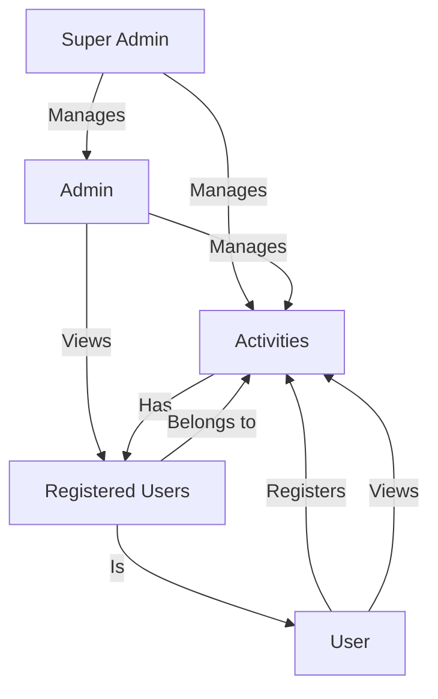
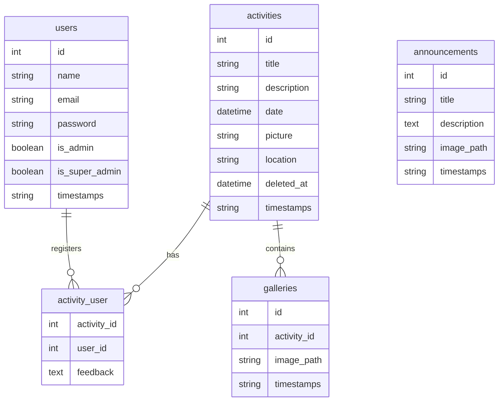

# PeBS Management System

## Overview

A centralized, interactive web platform for PeBS Zon 20 under MBSA that serves as the official information hub, facilitates youth registration, and manages program activities. The system supports multiple user roles (Super Admin, Admin, User) and provides dashboards and management features for each.

## System Architecture

### User Roles & Flows

- **Super Admin Dashboard**
  - Manage Admins (CRUD)
  - View and manage all activities
  - Restore deleted activities

- **Admin Dashboard**
  - Manage activities (CRUD)
  - View registered users for activities

- **User Dashboard**
  - View available activities
  - Register for activities
  - View registration status

#### User Flow Diagram



### Main Features

- User authentication (Laravel Breeze)
- Role-based access (Super Admin, Admin, User)
- Activity management (create, edit, delete, restore)
- User registration for activities
- Admin management by Super Admin
- Responsive UI with Blade and Bootstrap

## Database Schema

- **users**
  - id, name, email, password, is_admin, is_super_admin, timestamps
- **activities**
  - id, title, description, date, picture, location, deleted_at, timestamps
- **activity_user** (pivot)
  - activity_id, user_id, feedback (nullable)
- **announcements**
  - id, title, description, image_path (nullable), timestamps
- **galleries**
  - id, activity_id (foreign key), image_path, timestamps

#### Database Schema Diagram



## Technology Stack

- **Backend:** PHP 8.2+ with Laravel 12.x
- **Database:** MySQL/MariaDB
- **Frontend:** Blade templating, Bootstrap 5, Tailwind CSS (for some components)
- **Authentication:** Laravel Breeze
- **Task Runner:** Vite
- **Testing:** PHPUnit

## Security Features

- Laravel authentication with role-based access control
- CSRF protection
- Form validation
- Password hashing

## Getting Started

1. **Clone the repository**
   ```bash
   git clone <your-repo-url>
   cd pebs
   ```

2. **Install dependencies**
   ```bash
   composer install
   npm install
   ```

3. **Copy environment file**  
   Set your database and mail credentials.
   ```bash
   cp .env.example .env
   ```

4. **Generate application key**
   ```bash
   php artisan key:generate
   ```

5. **Run migrations**
   ```bash
   php artisan migrate
   ```

6. **(Optional) Seed Super Admin**
   ```bash
   php artisan db:seed --class=SuperAdminSeeder
   ```

7. **Serve the application**
   ```bash
   php artisan serve
   npm run dev
   ```

## Requirements

- PHP >= 8.2
- Composer
- Node.js & NPM
- MySQL/MariaDB

## License

This project is proprietary software developed for PeBS Zon 20 under MBSA.
